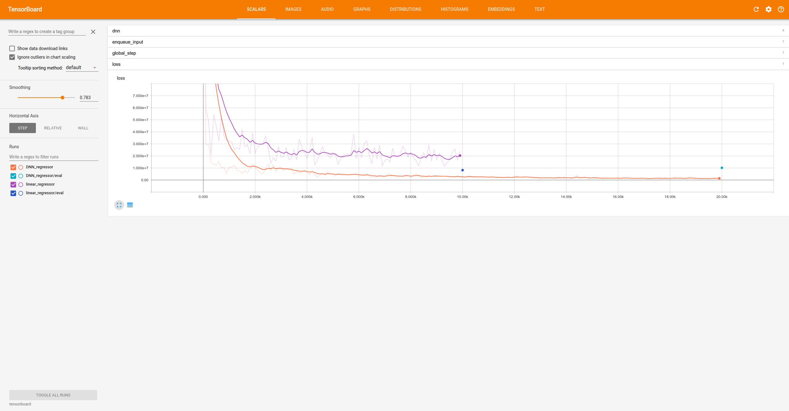

# Structured Data Example using canned Estimators

Here is a sample code for a structured data problem using DNN canned
estimator and LinearRegression canned estimator.

## Dataset

https://archive.ics.uci.edu/ml/machine-learning-databases/autos/imports-85.data

## Tensorboard result

