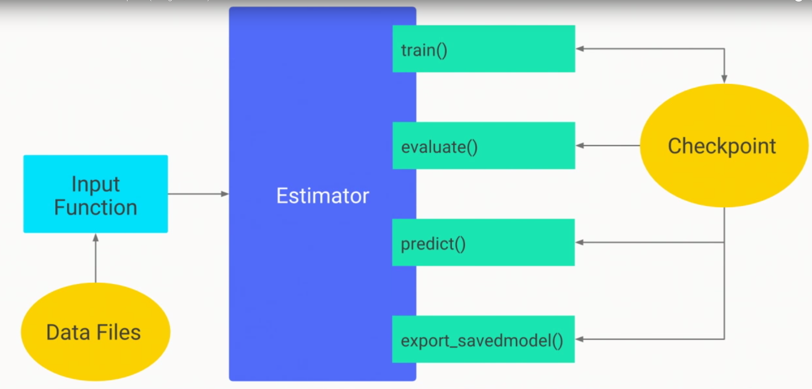
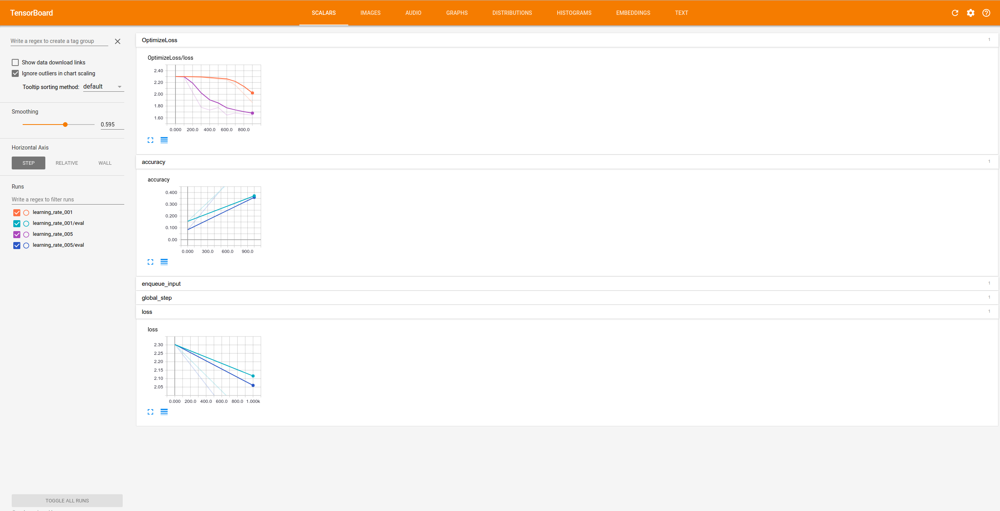
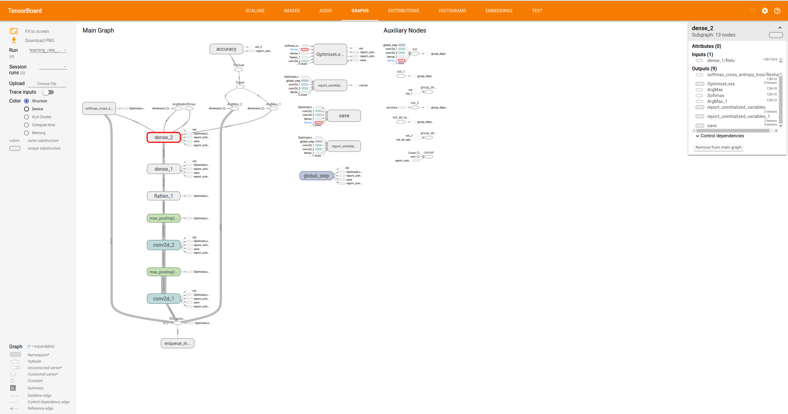

# Some things we get for free by using Estimators

Estimators are a high level abstraction (Interface) that supports all
the basic operations you need to support a ML model on top of TensorFlow.

Estimators:
  * provide a simple interface for users of canned model architectures:
  Training, evaluation, prediction, export for serving.
  * provide a standard interface for model developers
  * drastically reduces the amount of user code required.
  This avoids bugs and speeds up development significantly.
  * enable building production services against a standard interface.
  * using experiments abstraction give you free data-parallelism
  (more [here](https://github.com/mari-linhares/tensorflow-workshop/tree/master/code_samples/distributed_tensorflow))

In the Estimator's interface includes: Training, evaluation, prediction,
export for serving.

Image from [Effective TensorFlow for Non-Experts (Google I/O '17)](https://www.youtube.com/watch?v=5DknTFbcGVM)

Here we're going to show how Estimators make your life easier, once you have a estimator model is very simple to change your model and compare results.

More about it [here](https://www.tensorflow.org/extend/estimators)
